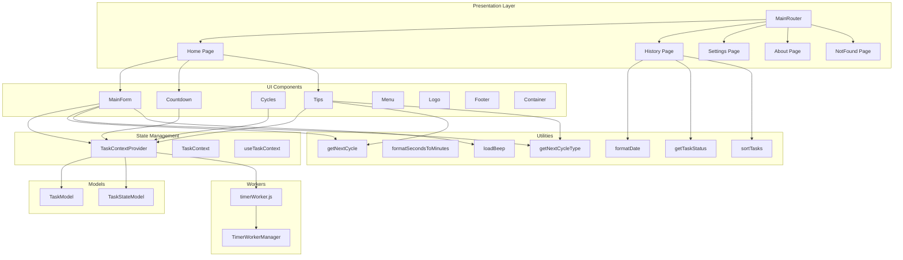

# Pomodorus Application Documentation

## Overview

Pomodorus is a Pomodoro time-management application. Users can start focus or break cycles, track tasks, and review their history. The app supports customizable durations for work sessions, short breaks, and long breaks. State is managed via React Context and persisted in `localStorage`, while timing runs in a Web Worker to keep the UI responsive.

## Architecture Overview



## Presentation Layer

### Routing

#### **MainRouter** (`src/routers/MainRouter/index.tsx`)
- Defines client-side routes using React Router.
- Routes:
  - `/` → Home page
  - `/history` → History page
  - `/settings` → Settings page
  - `/about-pomodoro` → About page
  - `*` → NotFound page
- Automatically scrolls to top on navigation via a nested `ScrollToTop` component.

### Pages

#### **Home Page** (`src/pages/Home/index.tsx`)
- Landing screen to create or view the active task.
- Renders:
  - `MainTemplate` wrapper
  - `MainForm` for starting/interruption
  - `Countdown` timer display
  - `Tips` for guidance

#### **History Page** (`src/pages/History/index.tsx`)
- Shows a sortable table of past tasks.
- Allows clearing history with confirmation.
- Sorts by fields (`name`, `duration`, `startDate`) and direction.

#### **Settings Page** (`src/pages/Settings/index.tsx`)
- Form for customizing durations: focus, short break, long break.
- Validates inputs and dispatches `CHANGE_SETTINGS`.
- Displays success or error toasts.

#### **About Page** (`src/pages/AboutPomodorus/index.tsx`)
- Explains the Pomodoro technique and app features.
- Uses `GenericHtml` to render rich text and links.

#### **NotFound Page** (`src/pages/NotFound/index.tsx`)
- Fallback for undefined routes.
- Suggests navigation back home or to history.

## UI Components

Each component accepts `children` or specific props to render styled UI elements.

- **Container** (`src/components/Container/index.tsx`)
  - Wraps content with consistent page layout.
  - Props: `children: React.ReactNode`.

- **Logo** (`src/components/Logo/index.tsx`)
  - Displays app title with icon linking to home.

- **Menu** (`src/components/Menu/index.tsx`)
  - Navigation links (Home, History, Settings, Theme toggle).
  - Persists theme choice in `localStorage` and updates `data-theme` attribute.

- **MainForm** (`src/components/MainForm/index.tsx`)
  - Handles new task creation and interruption.
  - Uses:
    - `DefaultInput` for text entry
    - `DefaultButton` for start/stop actions
    - `showMessage` adapter for toasts
    - `getNextCycle`/`getNextCycleType` to compute durations
    - `dispatch` of `START_TASK` or `INTERRUPT_TASK`

- **Countdown** (`src/components/Countdown/index.tsx`)
  - Displays `state.formattedSecondsRemaining` from context.

- **Cycles** (`src/components/Cycles/index.tsx`)
  - Visual cycle indicators (colored dots) based on completed cycles.

- **Tips** (`src/components/Tips/index.tsx`)
  - Shows dynamic hints depending on active task state and next cycle.

- **DefaultInput** (`src/components/DefaultInput/index.tsx`)
  - Styled input with optional label.
  - Props: `id`, `labelText?`, plus native input props.

- **DefaultButton** (`src/components/DefaultButton/index.tsx`)
  - Icon button with `green` or `red` variants.
  - Props: `icon: React.ReactNode`, `color?`, native button props.

- **Dialog** (`src/components/Dialog/index.tsx`)
  - Custom confirm/cancel layout for `react-toastify`.
  - Accepts `data: string` and `closeToast` callbacks.

- **MessagesContainer** (`src/components/MessagesContainer/index.tsx`)
  - Renders `ToastContainer` with bounce transition and default settings.

- **RouterLink** (`src/components/RouterLink/index.tsx`)
  - Wrapper over React Router’s `Link` using `href` prop.

- **Header** (`src/components/Header/index.tsx`)
  - Styled `<h1>` for section titles.

- **GenericHtml** (`src/components/GenericHtml/index.tsx`)
  - Container for rich HTML content.

- **Footer** (`src/components/Footer/index.tsx`)
  - Site footer with links to About and home.

## State Management

### Context Definition

- **TaskContext** (`src/contexts/TaskContext/TaskContext.tsx`)
  - Holds global state and dispatch function.

- **useTaskContext** (`src/contexts/TaskContext/UseTaskContext.ts`)
  - Hook to consume `TaskContext`.

### Provider & Reducer

- **TaskContextProvider** (`src/contexts/TaskContext/TaskContextProvider.tsx`)
  - Initializes state via `useReducer` with `initialTaskState`.
  - Loads persisted state from `localStorage`.
  - Integrates with `TimerWorkerManager` to post and receive countdown updates.
  - Updates document title to show remaining time.
  - Persists every state change to `localStorage`.

- **initialTaskState** (`src/contexts/TaskContext/initialTaskState.ts`)
  - Default values:
    - `tasks: []`
    - `secondsRemaining: 0`
    - `formattedSecondsRemaining: "00:00"`
    - `activeTask: null`
    - `currentCycle: 0`
    - `config: { workTime: 25, shortBreakTime: 5, longBreakTime: 15 }`

- **taskActions** (`src/contexts/TaskContext/taskActions.ts`)
  - Enum `TaskActionsTypes`: `START_TASK`, `INTERRUPT_TASK`, `RESET_STATE`, `COUNT_DOWN`, `COMPLETE_TASK`, `CHANGE_SETTINGS`.
  - Action type definitions for payload and non-payload actions.

- **taskReducer** (`src/contexts/TaskContext/taskReducer.ts`)
  - Handles:
    1. **START_TASK**: sets `activeTask`, updates `currentCycle`, computes `secondsRemaining`, appends to `tasks`.
    2. **INTERRUPT_TASK**: nullifies `activeTask`, logs `interruptDate` on task.
    3. **COUNT_DOWN**: updates `secondsRemaining` and `formattedSecondsRemaining`.
    4. **COMPLETE_TASK**: marks `completeDate`, resets `activeTask`, `secondsRemaining`.
    5. **CHANGE_SETTINGS**: updates `config`.
    6. **RESET_STATE**: clears all tasks and resets cycles.

## Data Models

- **TaskModel** (`src/models/TaskModel.ts`)
  - Properties:
    - `id: string`
    - `name: string`
    - `startDate: number`
    - `completeDate: number | null`
    - `interruptDate: number | null`
    - `duration: number` (minutes)
    - `type: "workTime" | "shortBreakTime" | "longBreakTime"`

- **TaskStateModel** (`src/models/TaskStateModel.ts`)
  - Properties:
    - `tasks: TaskModel[]`
    - `secondsRemaining: number`
    - `formattedSecondsRemaining: string`
    - `activeTask: TaskModel | null`
    - `currentCycle: number`
    - `config: { workTime: number; shortBreakTime: number; longBreakTime: number }`

## Utilities

- **formatDate** (`src/utils/formatDate.ts`)
  - Formats timestamp to `"dd/MM/yyyy HH:mm"` using `date-fns`.

- **formatSecondsToMinutes** (`src/utils/formatSecondsToMinutes.ts`)
  - Converts seconds to `"MM:SS"` string.

- **getNextCycle** (`src/utils/getNextCycle.ts`)
  - Calculates next cycle index (resets at 8).

- **getNextCycleType** (`src/utils/getNextCycleType.ts`)
  - Maps cycle index to type: odd → work, even → short break, cycle 8 → long break.

- **getTaskStatus** (`src/utils/getTaskStatus.ts`)
  - Returns `"In Progress"`, `"Completed"`, or `"Interrupted"` based on task dates.

- **loadBeep** (`src/utils/loadBeep.ts`)
  - Preloads an audio beep and returns a play function.

- **sortTasks** (`src/utils/sortTasks.ts`)
  - Sorts tasks array by specified field and direction, handling nulls.

## Workers

- **timerWorker.js** (`src/workers/timerWorker.js`)
  - Web Worker script that receives the current state and posts remaining seconds every second until completion.

- **TimerWorkerManager** (`src/workers/timerWorkerManager.ts`)
  - Singleton manager that spawns the worker, handles `onmessage`, `postMessage`, and `terminate`.

```card
{
  "title": "State Persistence",
  "content": "Task state, including history and config, is saved in localStorage and restored on reload."
}
```

## Templates & Entry

- **MainTemplate** (`src/templates/MainTemplate/index.tsx`)
  - Standard layout: `Logo` → `Menu` → page content → `Footer`.

- **App** (`src/App.tsx`)
  - Wraps `TaskContextProvider` and `MessagesContainer` around `MainRouter`.

- **main.tsx**
  - Bootstraps React app into `index.html` root.

- **index.html**
  - Basic HTML scaffold with `<div id="root">` and default theme attribute.

---

This documentation covers the core files of the Pomodorus project, illustrating how presentation, state, models, utilities, and workers collaborate to deliver a seamless Pomodoro experience.
